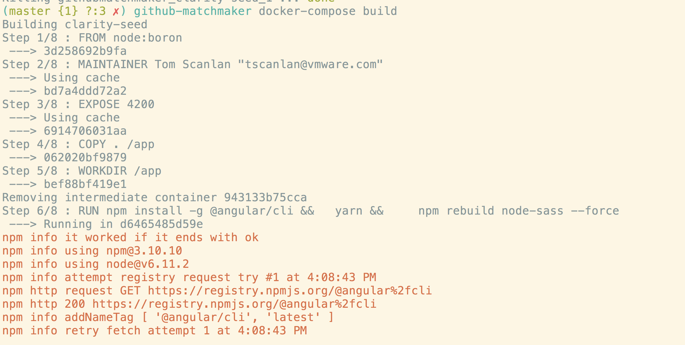
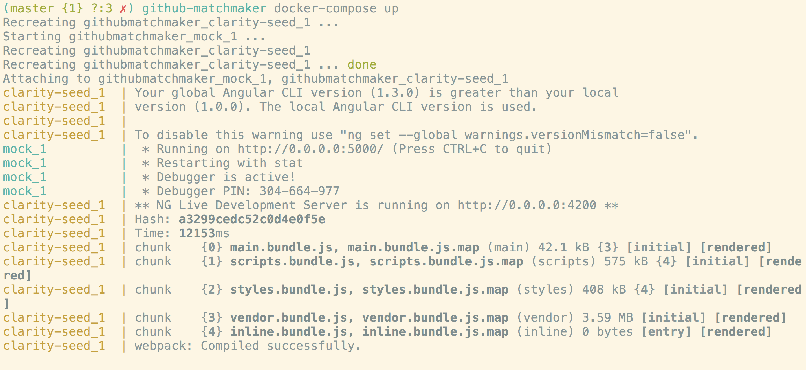
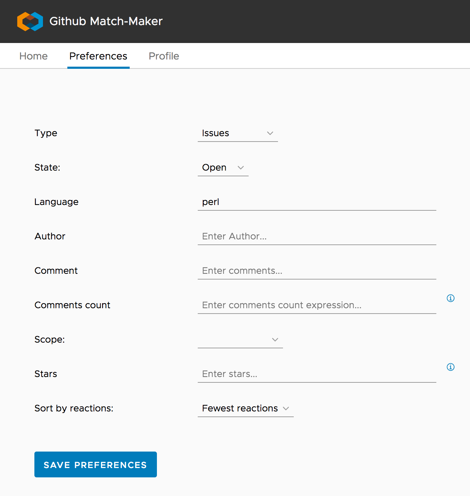

# github-matchmaker

A project to help you pick a github project to contribute to.  Also, you can contribute to this one :)

Proposed as a [VMware](http://www.vmware.com) Borathon project by team who-has-free-time.


## Description
Sometimes we have got a bit of free time, and would love to help fix issues
or add features to an existing project.
If we could identify a high visibility issue fit our preferences,
then we would be more likely to submit patches that have a big
impact for an existing project.

Those preferences may be something like:
* issue could be completed in our allotted time frame
* issue matches our skill level
* project is in a specific language or technology area
* other criteria....

## A loose direction


* Create a stateless UI to 
    * gather preferences, 
    * query a set of query-generator services with those preferences
    * Assemble responses from those services into a github query
    * run the github query
    * display the results
    * possibly allow rating of results to be sent back to query-generators to influence
      their algorithms 
      
* Create a set of query-generator services that
    * accept some seed input
    * map the input to a github query term the service finds relevent
    * return the github search query term
     
* ideas for query-generators:
  * [language](./query-services/language).  `seed=perl` might yield `query=lang:perl`
  * repository visibility. `seed=low` might yeild `query=comments>10`
  * level of pain of the issue. `seed=high` might yield `query=comments>30 +1 in:comments` 
  * available time commitment, or difficulty of the fix. `seed=low` might yield `query="not hard" in:comments or easy in:comments`


## Outcomes
* Prevent project sprawl by helping to ID code repositories doing things you are interested in. 
* give best bang for your contribution 
* enable low skill coders to contribute to projects that may not be tagged in a way to facilitate contributions 
* allow experimentation in a language you would like to learn 
* allow scratching the code itch without starting a whole new project


## Build and run:

```
docker-compose build
docker-compose up

curl http://localhost:4200
```







## Testing
Tested on a mac, but real requirement is docker-compose.

```
# git clone this repo

git clone https://github.com/tompscanlan/github-matchmaker
cd github-matchmaker/integ-test/
./test.sh

```

## Deploy
cd digital-ocean
export DO_TOKEN=00000000000000000000
terraform apply \
  -var "do_token=${DO_TOKEN}" \
  -var "pub_key=$HOME/.ssh/id_rsa.pub" \
  -var "pvt_key=$HOME/.ssh/id_rsa"


License
-------

Copyright VMware
